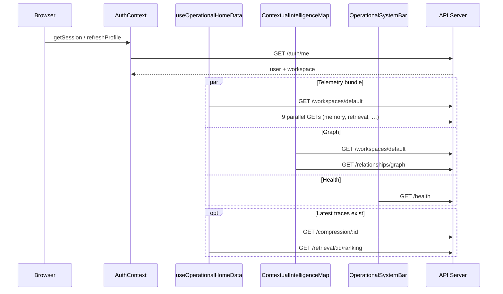

# Dashboard Load Performance Audit

**Date:** 2026-06-08  
**Scope:** Initial load of the operational dashboard at `/` (HomePage), plus cross-cutting shell behavior on every authenticated route.

This audit answers five questions about network fan-out, payload size, eager data loading, analytics on render, and React re-render patterns. Findings are derived from static code analysis of `apps/dashboard` and `apps/api`. Payload estimates should be validated in Chrome DevTools → Network (filter `Fetch/XHR`, disable cache, hard reload).

---

## Executive Summary

| Question | Short answer |
|----------|--------------|
| API requests on dashboard load | **14–16 HTTP requests** on `/` (up to **~30 in React StrictMode dev** due to double `useEffect`) |
| JSON returned | **~50 KB–2 MB** typical active workspace; **up to 5–8 MB** with large graphs and compression trace detail |
| Retrieval traces auto-loading | **Yes — list summaries** load on home via telemetry; **full trace bodies do not** unless you navigate to `/retrieval-traces` |
| Analytics on page render | **Yes — aggressively** via `fetchWorkspaceTelemetry()` on home, observability, and non-home metrics sidebar |
| Unnecessary React re-renders | **Yes — several sources**, including polling clocks, canvas animation state, duplicate mobile panels, and un-memoized telemetry fan-out |

---

## 1. How many API requests fire when the dashboard loads?

### Answer

On the default home route (`/`), **14–16 backend API requests** fire during the first paint cycle after auth resolves:

| # | Request | Source |
|---|---------|--------|
| 1 | `GET /auth/me` *or* `GET /workspaces/default` | `AuthContext.refreshProfile()` |
| 2 | `GET /workspaces/default` | `fetchWorkspaceTelemetry()` |
| 3–11 | 9 parallel requests (see below) | `fetchWorkspaceTelemetry()` `Promise.all` |
| 12–13 | `GET /compression/:id`, `GET /retrieval/:id/ranking` | Conditional follow-ups in telemetry |
| 14 | `GET /workspaces/default` | `ContextualIntelligenceMap` (duplicate) |
| 15 | `GET /relationships/graph?workspaceId=…` | `ContextualIntelligenceMap` |
| 16 | `GET /health` | `OperationalSystemBar` (duplicate of telemetry health call) |

The nine parallel telemetry requests:

```
GET /memory?workspaceId=…&limit=100
GET /retrieval?workspaceId=…&limit=50
GET /ingestion?workspaceId=…&limit=30
GET /compression?workspaceId=…&limit=30
GET /context/render?workspaceId=…&limit=20
GET /diagnostics/drift?workspaceId=…&limit=50
GET /diagnostics/operational?workspaceId=…&limit=100
GET /retrieval/heatmaps?workspaceId=…&limit=20
GET /health
```

**Non-home routes** add another full telemetry sweep via `MetricsSidebar` (+12 requests, many duplicated with page-specific fetches). Most pages also call `GET /workspaces/default` independently.

### Why

The home page was designed as a **live operational command center**: one mega-fetch (`fetchWorkspaceTelemetry`) aggregates memories, all trace types, diagnostics, heatmaps, and health into sidebar panels, stream events, and indicator pills. The center graph and system bar each maintain **independent fetch logic** rather than sharing a data layer.

### How

1. `ProtectedRoute` blocks render until `AuthContext` finishes session + profile resolution.
2. `HomePage` mounts → `useOperationalHomeData()` immediately calls `fetchWorkspaceTelemetry()`.
3. `ContextualIntelligenceMap` mounts in parallel with its own `loadGraph()` effect.
4. `OperationalSystemBar` mounts with a separate `/health` poll on mount.
5. No request deduplication, caching, or shared React Query/SWR layer exists.

### When

- **First load:** All requests fire as soon as auth `loading` becomes `false` and HomePage mounts.
- **Every 15 s:** `useOperationalHomeData` re-fetches full telemetry (all 12 requests again).
- **Every 20 s:** `MetricsSidebar` (non-home) re-fetches full telemetry.
- **Tab visibility:** `AuthContext` re-calls `/auth/me` when the document becomes visible.
- **React StrictMode (dev only):** `main.tsx` wraps the app in `<StrictMode>`, causing mount/unmount/remount — **effects run twice**, roughly doubling initial requests during local development.

### Where

| File | Role |
|------|------|
| `apps/dashboard/src/context/AuthContext.tsx` | Auth profile fetch |
| `apps/dashboard/src/lib/workspaceTelemetry.ts` | Mega-fetch orchestrator |
| `apps/dashboard/src/components/homepage/useOperationalHomeData.ts` | Home hook + 15 s polling |
| `apps/dashboard/src/components/homepage/ContextualIntelligenceMap.tsx` | Graph fetch (duplicate workspace) |
| `apps/dashboard/src/components/homepage/OperationalSystemBar.tsx` | Duplicate `/health` |
| `apps/dashboard/src/components/layout/MetricsSidebar.tsx` | Non-home telemetry sidebar |
| `apps/dashboard/src/components/Layout.tsx` | Hides metrics sidebar on `/` only |

### Alternatives and solutions

| Approach | Impact | Effort |
|----------|--------|--------|
| **Single bootstrap endpoint** — `GET /workspaces/:id/dashboard-bootstrap` returning summaries only | Cuts 14→2 requests; server can batch DB queries | Medium — new API route + slim DTO |
| **Shared data context** — `WorkspaceTelemetryProvider` at Layout level | Eliminates duplicate fetches between home, sidebar, observability | Low–medium |
| **Request deduplication** — React Query / SWR with shared cache keys | Collapses duplicate `/workspaces/default`, `/health`, `/retrieval` | Low |
| **Lazy load graph** — defer `/relationships/graph` until map scrolls into view or after telemetry settles | Removes 2 requests from critical path | Low |
| **Remove StrictMode double-fetch concern in dev** — use React Query `staleTime` or dedupe in `api.ts` | Dev experience matches prod request count | Low |
| **Split telemetry tiers** — `light` (counts + health) on load; `full` (diagnostics, ranking, compression detail) on demand | Reduces initial fan-out from 12→4 | Medium |

**Recommended first step:** Add in-flight deduplication to `apiGet` (Map keyed by URL) and hoist workspace ID resolution to `AuthContext` so child components read `workspace.workspaceId` instead of re-fetching `/workspaces/default`.

---

## 2. How many MB of JSON return?

### Answer

| Workspace state | Estimated total JSON (home load) | Dominant endpoints |
|-----------------|----------------------------------|--------------------|
| Empty / seed only | **5–30 KB** | Empty arrays from list routes |
| Moderate activity (~100 memories, ~50 retrievals) | **300 KB–1.5 MB** | `/relationships/graph`, `/diagnostics/operational` |
| Heavy activity (200 memories, rich compression traces) | **2–5 MB** | Graph + compression detail + ranking breakdown |
| Worst case (large context packages in latest compression trace) | **5–8 MB+** | `GET /compression/:id` includes full `originalContextPackage` + `optimizedContextPackage` |

### Why

Payload size is driven by **three heavy endpoints**, not the trace list summaries:

1. **`GET /relationships/graph`** — Server loads up to 200 memories (with chunk metadata), all relationships, heatmap, 50 retrieval ops, 30 compression ops, then returns nodes, edges, domains, timeline events, and embedded retrieval traces. The home map uses only `nodes` and `edges` (capped client-side to 24 nodes / 40 edges) but downloads the full graph.

2. **`GET /diagnostics/operational?limit=100`** — Server re-loads each retrieval operation's full `result` JSON (N+1 pattern) and attaches replay snapshots. The dashboard only consumes `report.lowConfidenceRetrievals.length`.

3. **Conditional follow-ups in telemetry** — `GET /compression/:latestId` returns full compression trace including context packages; `GET /retrieval/:id/ranking` returns `rankingBreakdown` + `chunkTraces`.

List endpoints (`/retrieval`, `/ingestion`, `/compression`) return **summary rows only** (~150 bytes each) — not full trace bodies.

### How

```
fetchWorkspaceTelemetry()
  ├─ Parallel lists (~50–150 KB combined at moderate scale)
  ├─ /diagnostics/operational  (~100–500 KB; scales with trace count + snapshot size)
  ├─ /diagnostics/drift        (~20–200 KB; replay snapshot summaries)
  ├─ /relationships/graph      (~150 KB–2 MB)
  ├─ /compression/:id          (~50 KB–3 MB if context packages present)
  └─ /retrieval/:id/ranking    (~20–200 KB)
```

### When

- Payload peaks on **first load** when all endpoints return concurrently.
- **15 s polling** re-downloads the full telemetry bundle even if only timestamps changed.
- Payload grows with workspace history (more traces → larger operational diagnostics and graph timeline).

### Where

| File | Payload concern |
|------|-----------------|
| `apps/dashboard/src/lib/workspaceTelemetry.ts` | Orchestrates all fetches; only uses summary fields from most responses |
| `apps/api/src/lib/relationship-graph-store.ts` | Builds full graph (200 memories, all edges, timeline, retrievalTraces) |
| `apps/api/src/routes/historian.ts` | `/diagnostics/operational` N+1 loads full `retrievalOperation.result` per trace |
| `apps/api/src/lib/compression-store.ts` | `getCompressionTrace` returns full context packages |

### Alternatives and solutions

| Approach | Savings | Notes |
|----------|---------|-------|
| **`GET /relationships/graph?lite=true`** — nodes + edges only, no timeline/retrievalTraces/chunk metadata | 50–80% graph size | Map component needs ~5 fields per node |
| **Slim operational diagnostics** — return counts + IDs, not enriched trace snapshots | Major reduction on `/diagnostics/operational` | Fix server N+1 while at it |
| **Telemetry uses list endpoints only** — drop compression detail + ranking follow-ups from initial load | Removes largest conditional payloads | Load ranking on Observability page only |
| **Field projection query param** — `?fields=id,title,memoryType` on `/memory` | 30–50% on memory list | Generic pattern for all list routes |
| **Compression summary endpoint** — metadata only (`originalTokens`, `optimizedTokens`, `fidelityScore`) | Avoids multi-MB context packages for dashboard metrics | New route or `?summary=true` |
| **gzip/brotli** — ensure API responses are compressed | 60–80% wire size | Vercel/Fastify default; verify locally |

**Recommended first step:** Add a `lite` graph variant and a compression metadata-only route; switch `fetchWorkspaceTelemetry` to use them. This alone can drop home load from ~1.5 MB to ~200 KB for typical workspaces.

---

## 3. Are retrieval traces loading automatically?

### Answer

**Partially — it depends what "retrieval traces" means:**

| Data | Auto-loads on `/`? | Auto-loads on `/retrieval-traces`? |
|------|--------------------|------------------------------------|
| Trace **list summaries** (id, query, status, timestamps) | **Yes** — via `fetchWorkspaceTelemetry` → `GET /retrieval?limit=50` | **Yes** — `GET /retrieval?limit=50` |
| Full trace **detail** (context package, stages, augmentation) | **No** | **Yes, when `:traceId` is in the URL** — 3 parallel requests |
| Heatmap entries | **Yes** on home (telemetry) | **Yes** on list view |
| Ranking breakdown | **Yes** on home — latest completed trace only | No (unless viewing detail) |
| Events / augmentation | **No** on home | **Yes** on detail view |

The home page **does not mount** `RetrievalTracesPage`. It consumes retrieval data only as feed input for `LiveOperationalStream` and confidence metrics — not as inspectable trace records.

### Why

`fetchWorkspaceTelemetry` treats retrievals as **one input among many** for operational indicators. The dedicated traces UI is route-isolated and loads heavier payloads only when the user navigates there.

### How

**Home path:**

```typescript
// workspaceTelemetry.ts
apiGet(`/retrieval?workspaceId=${workspaceId}&limit=50`)
// → builds events, activity feed, latency stats
// → optionally: GET /retrieval/${latestId}/ranking
```

**Retrieval traces page path:**

```typescript
// RetrievalTracesPage.tsx — list mode (no traceId)
Promise.all([
  apiGet("/retrieval?limit=50"),
  apiGet("/retrieval/heatmaps?…"),
  apiGet("/retrieval/plans?…"),
])

// Detail mode (traceId present)
Promise.all([
  apiGet(`/retrieval/${traceId}`),      // full trace
  apiGet(`/events/${traceId}`),
  apiGet(`/augmentation/${traceId}`),
])
```

Server-side, list vs detail is strictly separated in `listRetrievalTraces` (summary rows) vs `getRetrievalTrace` (full `contextPackage`).

### When

- **Home:** Retrieval list loads immediately on mount; ranking loads if any completed retrieval exists.
- **Retrieval traces page:** List loads on mount; detail loads when URL contains `:traceId` or when user clicks a trace.
- **Compression traces page:** Also pre-fetches retrieval list (`limit=30`) for the compression picker dropdown.

### Where

| File | Behavior |
|------|----------|
| `apps/dashboard/src/lib/workspaceTelemetry.ts` | Home auto-fetch of retrieval summaries + latest ranking |
| `apps/dashboard/src/pages/RetrievalTracesPage.tsx` | Full traces UI |
| `apps/dashboard/src/pages/CompressionTracesPage.tsx` | Secondary retrieval list fetch |
| `apps/api/src/lib/retrieval-store.ts` | `listRetrievalTraces` vs `getRetrievalTrace` |

### Alternatives and solutions

| Approach | When to use |
|----------|-------------|
| **Remove retrieval list from home telemetry** — compute latency from a dedicated metrics endpoint | If home stream doesn't need live retrieval events |
| **Lazy-load ranking** — only fetch on Observability or Retrieval Diagnostics pages | If confidence pill on home is non-critical |
| **Virtualized trace list** — load 20 at a time with cursor pagination | Retrieval traces page with large histories |
| **Prefetch on hover** — fetch trace detail when user hovers a row, not on click | Faster perceived detail navigation |
| **WebSocket push for stream events** — replace 15 s polling of full telemetry | Real-time home stream without re-fetching all traces |

**Recommended:** Keep summary list on home (it's cheap — ~8 KB for 50 traces) but **remove the ranking follow-up** from the critical path; show confidence as "—" until Observability loads or user expands a panel.

---

## 4. Are analytics loading on page render?

### Answer

**Yes.** Analytics are not deferred, gated behind user interaction, or scoped to the Observability route. They load **synchronously on first render** via `useEffect` hooks.

### What loads as "analytics"

| Analytics data | Endpoint | Loaded on `/` | Loaded on other routes |
|----------------|----------|---------------|------------------------|
| System health | `/health` | Yes (×2) | Yes (MetricsSidebar) |
| 24h retrieval count, latency, error rate | derived from `/retrieval` list | Yes | Yes |
| Token throughput | derived from `/context/render` list | Yes | Yes |
| Drift signals | `/diagnostics/drift` | Yes | Yes |
| Low-confidence / failed retrieval reports | `/diagnostics/operational` | Yes | Yes |
| Retrieval heatmap | `/retrieval/heatmaps` | Yes | Yes (Observability, Retrieval Traces) |
| Compression ratio / fidelity | `/compression/:id` detail | Yes (if traces exist) | Yes |
| Ranking explainability | `/retrieval/:id/ranking` | Yes (if traces exist) | Yes (Observability) |
| Relationship graph analytics | `/relationships/graph` | Yes | No (Relationship Map has its own fetch) |

The **Observability page** (`/observability`) calls the same `fetchWorkspaceTelemetry()` — it does not add unique analytics on top; it re-displays the same bundle.

### Why

The dashboard treats the home page as an **operational NOC (network operations center)** rather than a navigation hub. Product intent: show live intelligence state immediately, not after the user clicks "Load analytics."

### How

Every consumer follows the same pattern:

```typescript
useEffect(() => {
  void fetchWorkspaceTelemetry().then(setTelemetry);
}, []);
```

No `loading="lazy"`, no Intersection Observer, no route-based code splitting for data.

### When

- **Immediately** on component mount (after auth gate).
- **Re-polls:** home every 15 s, metrics sidebar every 20 s.
- **Not on demand:** no "Refresh analytics" without full re-fetch.

### Where

| File | Analytics loaded |
|------|------------------|
| `apps/dashboard/src/components/homepage/useOperationalHomeData.ts` | Full telemetry bundle |
| `apps/dashboard/src/components/layout/MetricsSidebar.tsx` | Full telemetry bundle |
| `apps/dashboard/src/pages/ObservabilityPage.tsx` | Full telemetry bundle |
| `apps/dashboard/src/components/homepage/ContextualIntelligenceMap.tsx` | Graph analytics (separate) |

### Alternatives and solutions

| Tier | Load on render | Defer until |
|------|----------------|-------------|
| **Tier 0 — Shell** | Auth, workspace ID, health | Never |
| **Tier 1 — Counts** | Memory count, trace counts, 24h ops | Never (cheap) |
| **Tier 2 — Diagnostics** | Drift, operational, heatmap | User opens Observability or expands intelligence panel |
| **Tier 3 — Deep detail** | Compression trace, ranking breakdown, full graph | User clicks into specific tool |

**Implementation options:**

1. Split `fetchWorkspaceTelemetry` into `fetchTelemetrySummary()` and `fetchTelemetryAnalytics()`.
2. Use React Query with `enabled: false` for Tier 2/3; trigger on panel expand or route enter.
3. Server-side: `GET /workspaces/:id/metrics/summary` returning pre-aggregated counts (no trace lists).

---

## 5. Is React re-rendering unnecessarily?

### Answer

**Yes.** Several patterns cause re-renders that do not correspond to user-visible data changes. None are catastrophic alone, but combined with Framer Motion layout animations and a 60 fps canvas, they add main-thread work during load and idle.

### Re-render sources (ranked by impact)

#### 5.1 Telemetry polling re-renders entire home tree

**Where:** `useOperationalHomeData.ts` — full `setTelemetry(data)` every 15 s.

**Impact:** `HomePage` → `OperationalSystemBar`, `LiveOperationalStream`, `OperationalIntelligencePanels` all re-render even if only one event timestamp changed.

**Fix:** Shallow-compare telemetry slices before `setState`; split into separate contexts (indicators vs events vs panels); use React Query structural sharing.

#### 5.2 Duplicate mobile panel mount

**Where:** `HomePage.tsx` renders `LiveOperationalStream` and `OperationalIntelligencePanels` **twice** — once in the desktop grid (`hidden lg:block`) and once in the mobile footer (`lg:hidden`).

**Impact:** On viewports that match both breakpoints during resize, or in SSR/hydration edge cases, duplicate subscriptions and DOM. On mobile, two copies of the same event list exist in the tree (one hidden via CSS).

**Fix:** Single instance with responsive layout CSS; or `useMediaQuery` to mount one copy.

#### 5.3 Canvas animation drives React state

**Where:** `ContextualIntelligenceMap.tsx` — `requestAnimationFrame` loop runs continuously; `updatePhaseLabel` calls `setPhaseLabel` on phase transitions; `ResizeObserver` calls `setDimensions` on container resize.

**Impact:** Phase label changes ~every 4–12 s cause full section re-render. Dimensions changes re-render + restart D3 simulation (`useEffect` on `[dimensions, graphNodes, graphLinks]`).

**Fix:** Keep phase label in a ref + direct DOM update; decouple simulation restart from dimension changes (debounce resize); move canvas to a ref-only imperative layer with no React state for animation.

#### 5.4 AuthContext value identity

**Where:** `AuthContext.tsx` — `useMemo` for context value is correct, but `refreshProfile` is in the dependency array and recreated when `session` changes.

**Impact:** All `useAuth()` consumers re-render on session refresh (including tab visibility retry).

**Fix:** Split auth into `AuthSessionContext` + `AuthProfileContext`; stabilize callbacks with refs.

#### 5.5 Framer Motion `layout` on event cards

**Where:** `LiveOperationalStream.tsx` — `motion.article layout` on every event card.

**Impact:** Layout animations recalculate on every events array reference change (every 15 s poll).

**Fix:** Remove `layout` prop; use `layout={false}` or CSS transitions for enter/exit only.

#### 5.6 StrictMode double mount (dev only)

**Where:** `main.tsx` — `<StrictMode>`.

**Impact:** All mount effects run twice in development, causing double fetch + double loading state transitions + double initial render cascade.

**Fix:** Expected dev behavior; ensure fetch deduplication so side effects aren't duplicated on the wire.

#### 5.7 TopBar clock (non-home routes)

**Where:** `AppShell.tsx` — `TopBarClock` calls `setTime(new Date())` every 1 s.

**Impact:** TopBar re-renders every second on all non-home routes. Home uses `OperationalSystemBar` instead (no clock).

**Fix:** Update clock via ref + `textContent` without React state; or isolate clock in `React.memo` sibling.

#### 5.8 Unmemoized child components

**Where:** `OperationalIntelligencePanels`, `OperationalSystemBar`, `LiveOperationalStream` — no `React.memo`.

**Impact:** Re-render whenever parent `HomePage` re-renders from telemetry updates.

**Fix:** Wrap with `React.memo`; pass stable props; split polling state from display components.

### Why it matters

The home page combines **polling data updates**, **continuous canvas animation**, and **Framer Motion layout** in one view. Main-thread time spent on reconciliation competes with D3 force simulation and canvas painting, causing jank on lower-end devices.

### When re-renders spike

| Trigger | Frequency |
|---------|-----------|
| Telemetry poll | Every 15 s |
| Metrics sidebar poll | Every 20 s (non-home) |
| Canvas phase label | ~every 4–12 s |
| TopBar clock | Every 1 s (non-home) |
| Auth visibility refresh | On tab focus |
| StrictMode remount | Once on dev load |

### Alternatives and solutions

| Priority | Change | Expected gain |
|----------|--------|---------------|
| P0 | Dedupe API fetches + split telemetry context | Fewer render-triggering state updates |
| P1 | `React.memo` on home panels; remove `layout` from event cards | ~50% fewer home re-renders on poll |
| P1 | Ref-based phase label + clock in AppShell | Eliminate timer-driven re-renders |
| P2 | Single mobile/desktop panel instance | Cleaner tree, fewer subscriptions |
| P2 | React Query for telemetry with `select` per panel | Each panel subscribes to its slice only |

---

## Request waterfall (home load)



---

## Measurement checklist

To capture live numbers in your environment:

1. Start API + dashboard: `npm run dev:api` and `npm run dev:dashboard`.
2. Open `http://localhost:5173/` with DevTools → Network.
3. Hard reload (disable cache).
4. Record:
   - Total request count (filter Fetch/XHR).
   - Sum of response sizes (Status column → right-click → Copy all as HAR, or use "Transferred" total).
   - Time to last telemetry response (`fetchWorkspaceTelemetry` completion).
5. Repeat on `/observability` and `/memory` to compare non-home fan-out.
6. In React DevTools → Profiler, record 30 s on home to count commits from polling.

---

## Recommended remediation roadmap

| Phase | Work | Outcome |
|-------|------|---------|
| **1 — Quick wins** | In-flight request dedupe; share workspace ID from auth; remove duplicate `/health`; `React.memo` home panels | ~30% fewer requests; fewer re-renders |
| **2 — Payload slimming** | Lite graph endpoint; compression metadata route; slim operational diagnostics | Home load **< 300 KB** typical |
| **3 — Data layer** | React Query + split telemetry tiers; bootstrap endpoint | Predictable caching; 2–3 requests on load |
| **4 — Render optimization** | Ref-based canvas/clock; remove duplicate mobile panels; drop Framer `layout` on lists | Smooth 60 fps map + stable panels |

---

## Related documents

- [Execution Timing Audit System](./EXECUTION_TIMING_AUDIT_SYSTEM.md) — pipeline stage latency (API-side)
- [Database Query Observability](./DATABASE_QUERY_OBSERVABILITY.md) — N+1 on `/diagnostics/operational` aligns with dashboard payload findings
- [LLM Call Audit](./LLM_CALL_AUDIT.md) — LLM cost/latency (not dashboard load, but related observability surface)
