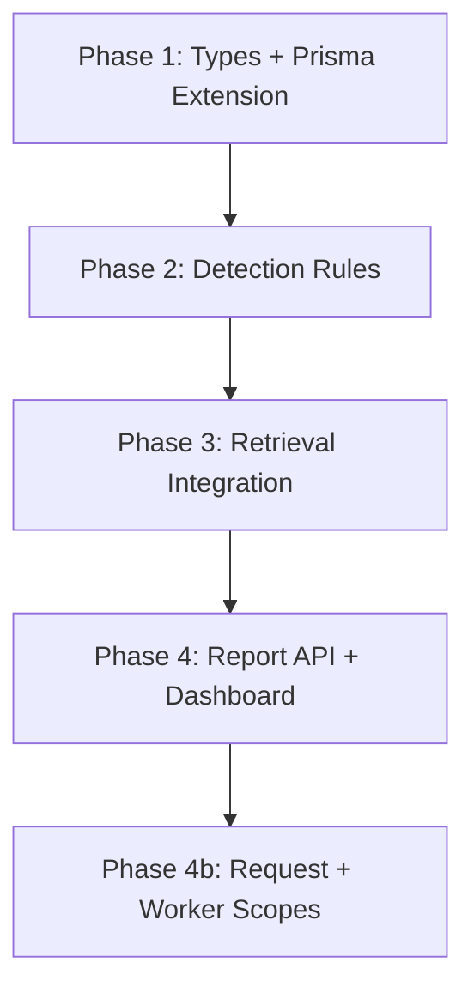

# Database Query Observability — Implementation Plan

## Objective

Create **scoped database query observability** across Prisma operations. Log query count, duration, slow queries, duplicate queries, and N+1 patterns. For retrieval operations, produce a structured summary payload and expose a report of the top 20 slowest database operations.

---

## Current State Assessment

| Area | Location | What exists | Gaps |
|------|----------|-------------|------|
| Prisma client | `apps/api/src/lib/database.ts` | Bare `PrismaClient()` singleton | No query timing, no scope correlation |
| HTTP layer | `packages/observability/src/middleware/request-logging.ts` | `response_time_ms` per request | No per-query breakdown |
| Retrieval | `apps/api/src/routes/retrieval.ts` | `traceId` as retrieval correlation ID | No DB time accounting |
| Events | `apps/api/src/lib/event-sink.ts` | Append-only `EventLog` via Prisma | Event writes not excluded from self-instrumentation |
| Diagnostics | `apps/api/src/routes/diagnostics.ts` | Retrieval trace analysis | No DB operation leaderboard |
| Worker | `apps/api/src/worker-main.ts` | Job tick loop | No query observability |

**Key architectural gap:** Prisma is the sole database access layer, but there is no instrumentation hook, no scope binding to retrieval/request/worker contexts, and no duplicate or N+1 detection.

---

## Design Principles

1. **Instrumentation only** — wrap Prisma operations; do not change query logic or business behavior.
2. **Scope correlation** — `retrievalId` = existing retrieval `traceId` (ULID). Reuse `AsyncLocalStorage` pattern from execution timing.
3. **Deterministic detection** — fingerprint queries by normalized model/operation/args shape; no ML or heuristics beyond explicit thresholds.
4. **Observability-first** — structured Pino logs + `EventLog` events for scope summaries.
5. **Non-recursive instrumentation** — exclude `EventLog` writes from aggregation (or use an uninstrumented client for the event sink).
6. **Additive output** — append `dbObservability` to retrieval responses; do not remove existing fields.

---

## Phase 1 — Shared Contracts & Core Library

### 1.1 Add types to `@memory-middleware/shared-types`

**New file:** `packages/shared-types/src/database-query-contracts.ts`

```typescript
export interface DbQueryRecord {
  queryId: string;
  model: string;
  operation: string;
  durationMs: number;
  fingerprint: string;
  isSlow: boolean;
  timestamp: string;
}

export interface DbDuplicateQueryGroup {
  fingerprint: string;
  count: number;
  totalDurationMs: number;
  sample: DbQueryRecord;
}

export interface DbNPlusOnePattern {
  fingerprint: string;
  count: number;
  model: string;
  operation: string;
}

export interface DbScopeSummary {
  scopeId: string;
  scopeType: "retrieval" | "request" | "worker" | "other";
  totalQueries: number;
  totalDbTime: number;
  slowQueries: DbQueryRecord[];
  duplicateQueries: DbDuplicateQueryGroup[];
  nPlusOnePatterns: DbNPlusOnePattern[];
}

/** Required retrieval output shape */
export interface RetrievalDbObservability {
  retrievalId: string;
  totalQueries: number;
  totalDbTime: number;
  slowQueries: DbQueryRecord[];
  duplicateQueries: DbDuplicateQueryGroup[];
}

export interface DbOperationLeaderboardEntry {
  scopeId: string;
  scopeType: string;
  totalDbTime: number;
  totalQueries: number;
  slowQueryCount: number;
  duplicateQueryCount: number;
  nPlusOneCount: number;
  completedAt: string;
}
```

Export from `packages/shared-types/src/index.ts`.

### 1.2 Add database module to `@memory-middleware/observability`

**New files:**

| File | Responsibility |
|------|----------------|
| `src/database/hrtime.ts` | Reuse or share with timing module — `durationMs` from `performance.now()` |
| `src/database/fingerprint.ts` | Normalize args (strip ID values), hash model + operation + shape |
| `src/database/aggregator.ts` | Per-scope query accumulation, slow/duplicate/N+1 detection |
| `src/database/scope.ts` | `AsyncLocalStorage` + `runWithDbObservationScope()` |
| `src/database/leaderboard.ts` | Bounded ring buffer sorted by `totalDbTime` |
| `src/database/instrument-prisma.ts` | Prisma `$extends` query hook |
| `src/database/emit.ts` | `emitDbScopeCompleted(logger, events, summary, metadata?)` |

**Scope API:**

```typescript
runWithDbObservationScope<T>(
  scope: { scopeId: string; scopeType: DbScopeSummary["scopeType"] },
  fn: () => Promise<T>,
): Promise<{ result: T; summary: DbScopeSummary }>;
```

**Prisma extension** (wrap every operation):

```typescript
query: {
  $allModels: {
    async $allOperations({ model, operation, args, query }) {
      const start = performance.now();
      const result = await query(args);
      recordQuery({ model, operation, args, durationMs: performance.now() - start });
      return result;
    },
  },
}
```

---

## Phase 2 — Detection Rules

### 2.1 Slow queries

- Threshold: **100ms** (configurable via `DB_SLOW_QUERY_MS`)
- Mark `isSlow: true`; include in `slowQueries[]`
- Log at `warn` for slow queries; `debug` for all queries

### 2.2 Duplicate queries

Fingerprint each query:

1. `model` + `operation`
2. Serialize `args` with ID values replaced by `"<id>"`
3. Sort object keys deterministically
4. Hash → `fingerprint`

**Duplicate:** same fingerprint executed **≥ 2 times** within a scope.

### 2.3 N+1 patterns

Within a scope, flag a fingerprint when:

- count **≥ 3** (configurable via `DB_N_PLUS_ONE_THRESHOLD`)
- operation is a read (`findUnique`, `findFirst`, `findMany`)
- normalized args contain a single-ID filter pattern

Emit as `nPlusOnePatterns` — informational, not blocking.

### 2.4 Per-query log shape

```json
{
  "event": "database.query.completed",
  "scope_id": "01J...",
  "scope_type": "retrieval",
  "model": "Memory",
  "operation": "findUnique",
  "duration_ms": 142,
  "is_slow": true,
  "fingerprint": "a3f2..."
}
```

### 2.5 Scope completion

| Channel | Event |
|---------|-------|
| Logger | `database.scope.completed` |
| EventLog | `event_type: "database.scope.completed"` with full `DbScopeSummary` in payload |

---

## Phase 3 — Integration Points

### 3.1 Database bootstrap

**File:** `apps/api/src/lib/database.ts`

- Export `createInstrumentedPrismaClient(logger, options)`
- Replace bare singleton with instrumented client
- Worker uses the same factory

### 3.2 Retrieval operations (primary requirement)

**Files:**

- `apps/api/src/routes/retrieval.ts`
- `apps/api/src/lib/workflow-retrieval.ts`
- `apps/api/src/routes/diagnostics.ts` (benchmark retrieval paths)

Wrap retrieval body:

```typescript
const { result, summary } = await runWithDbObservationScope(
  { scopeId: traceId, scopeType: "retrieval" },
  async () => runRetrievalPipeline({ ... traceId ... }),
);
```

Attach to response:

```typescript
{
  ...existingResponse,
  dbObservability: {
    retrievalId: traceId,
    totalQueries: summary.totalQueries,
    totalDbTime: summary.totalDbTime,
    slowQueries: summary.slowQueries,
    duplicateQueries: summary.duplicateQueries,
  },
}
```

### 3.3 Persist on retrieval completion

**File:** `apps/api/src/lib/retrieval-store.ts`

Store `dbObservability` inside `RetrievalOperation.result` JSON (alongside `stages`) for replay and historian access.

### 3.4 HTTP request scope (phase 4)

**File:** `apps/api/src/create-app.ts`

Fastify `onRequest` / `onResponse` hook with `scopeType: "request"` using `request.traceId`.

### 3.5 Worker scope (phase 4)

**File:** `apps/api/src/worker-main.ts`

Wrap each `processNextIngestionJob` tick with `scopeType: "worker"` and `scopeId: job.traceId`.

---

## Phase 4 — Top-20 Slowest Operations Report

### 4.1 In-memory ring buffer

Maintain a bounded store (default 500 entries) in the API process. On each `database.scope.completed`, push entry sorted by `totalDbTime`.

### 4.2 API endpoint

**New route:** `GET /diagnostics/db-operations?limit=20&scopeType=retrieval`

**File:** `apps/api/src/routes/diagnostics.ts`

```typescript
{
  generatedAt: string;
  entries: DbOperationLeaderboardEntry[];  // top 20 by totalDbTime
}
```

### 4.3 Historical report (optional)

Query `EventLog` where `event_type = 'database.scope.completed'`, order by `payload.totalDbTime DESC`, take 20. Enables cross-restart history without a dedicated table.

### 4.4 Dashboard (optional)

New panel under existing observability pages:

- Table: top 20 operations by `totalDbTime`
- Expand row → slow queries, duplicate groups, N+1 flags
- Link `scopeId` → retrieval trace page

---

## Configuration

Add to `apps/api/src/config/env.ts`:

| Env var | Default | Purpose |
|---------|---------|---------|
| `DB_SLOW_QUERY_MS` | `100` | Slow query threshold |
| `DB_OBSERVATION_ENABLED` | `true` | Kill switch |
| `DB_EXPLAIN_ON_SLOW` | `false` | Opt-in: capture sanitized EXPLAIN plans for slow read queries |
| `DB_EXPLAIN_ANALYZE` | `false` | When explain-on-slow is enabled, use EXPLAIN ANALYZE (re-executes query) instead of FORMAT JSON only |
| `DB_N_PLUS_ONE_THRESHOLD` | `3` | Min repeats to flag N+1 |
| `DB_LEADERBOARD_SIZE` | `500` | Ring buffer capacity |

---

## File Change Summary

| Package / App | Files | Change type |
|---------------|-------|-------------|
| `packages/shared-types` | `database-query-contracts.ts`, `index.ts` | New types |
| `packages/observability` | `database/*`, `index.ts` | New module |
| `apps/api` | `lib/database.ts` | Instrumented client |
| `apps/api` | `routes/retrieval.ts`, `lib/workflow-retrieval.ts` | Scope wrapping |
| `apps/api` | `lib/retrieval-store.ts` | Persist summary |
| `apps/api` | `routes/diagnostics.ts` | Leaderboard endpoint |
| `apps/api` | `config/env.ts` | Configuration |
| `apps/api` (later) | `create-app.ts`, `worker-main.ts` | Request/worker scopes |
| `apps/dashboard` (later) | observability panel | Read-only display |

**Estimated touch count:** ~15 files, ~500–700 LOC.

---

## Implementation Order



1. **Types + Prisma extension** — foundation, unit-tested in isolation
2. **Detection rules** — fingerprint, duplicate, N+1, slow threshold
3. **Retrieval integration** — scope wrapping, response payload, persist to `RetrievalOperation`
4. **Report API** — ring buffer + `GET /diagnostics/db-operations`
5. **Broader scopes** — HTTP request and worker job ticks
6. **Dashboard panel** — optional read-only display

---

## Testing Strategy

| Test | Location | Validates |
|------|----------|-----------|
| `fingerprint.test.ts` | `packages/observability` | ID stripping, deterministic hashing |
| `aggregator.test.ts` | `packages/observability` | Duplicate + N+1 detection |
| `scope.test.ts` | `packages/observability` | Parallel scope isolation |
| `leaderboard.test.ts` | `packages/observability` | Top-20 ordering |
| Retrieval integration | `apps/api` | Response includes `dbObservability` |
| Manual | `POST /retrieve` | Logs contain query events; leaderboard updates |

**Regression guard:** retrieval outputs (context packages, rankings) must be identical before/after instrumentation.

---

## Canonical Output Examples

### Retrieval response augmentation

```json
{
  "traceId": "01JXXXXXXXXXXXXXXXXXXXXXXX",
  "dbObservability": {
    "retrievalId": "01JXXXXXXXXXXXXXXXXXXXXXXX",
    "totalQueries": 47,
    "totalDbTime": 312.4,
    "slowQueries": [
      {
        "queryId": "01J...",
        "model": "MemoryChunk",
        "operation": "findMany",
        "durationMs": 142.3,
        "fingerprint": "a3f2...",
        "isSlow": true,
        "timestamp": "2026-06-08T14:32:01.245Z"
      }
    ],
    "duplicateQueries": [
      {
        "fingerprint": "b7c1...",
        "count": 12,
        "totalDurationMs": 84.6,
        "sample": { "model": "Memory", "operation": "findUnique", "durationMs": 7.1 }
      }
    ]
  }
}
```

### Leaderboard report

```json
{
  "generatedAt": "2026-06-08T14:35:00.000Z",
  "entries": [
    {
      "scopeId": "01JXXXXXXXXXXXXXXXXXXXXXXX",
      "scopeType": "retrieval",
      "totalDbTime": 312.4,
      "totalQueries": 47,
      "slowQueryCount": 3,
      "duplicateQueryCount": 2,
      "nPlusOneCount": 1,
      "completedAt": "2026-06-08T14:32:01.410Z"
    }
  ]
}
```

---

## Risks & Mitigations

| Risk | Mitigation |
|------|------------|
| Overhead on every query | Lightweight fingerprinting; no SQL parsing; ring buffer O(1) insert |
| False-positive N+1 | Threshold-based heuristic; flag as pattern, not error |
| Serverless cold starts lose leaderboard | EventLog persistence for historical report |
| `$extends` typing complexity | Export typed `InstrumentedPrismaClient` alias |
| Recursive logging (EventLog write triggers more queries) | Exclude `EventLog` model from aggregation, or uninstrumented client for event sink |
| ALS lost across worker boundaries | Worker creates own scope with job `traceId` |

---

## Slow-query EXPLAIN automation (Sprint-26 / OP-25)

When `DB_EXPLAIN_ON_SLOW=true`, the instrumented Prisma client registers a query-event hook that:

1. Fires only for queries exceeding `DB_SLOW_QUERY_MS`
2. Runs only on **read** SQL (`SELECT` / `WITH`) — writes are never explained
3. Emits `database.query.explain` structured logs with **sanitized** plan nodes (literals and IDs redacted)
4. Caps captures at **3 plans per scope** to limit overhead

Runtime default uses `EXPLAIN (FORMAT JSON)` (plan only). Set `DB_EXPLAIN_ANALYZE=true` for `EXPLAIN (ANALYZE, BUFFERS, FORMAT JSON)` when deeper measurement is acceptable.

Offline deep-dive: `npm run perf:explain-slow-query -- --sql "SELECT …"` (see `scripts/explain-slow-query.ts`).

---

## Out of Scope (V1)

- Distributed tracing or external APM integration
- Auto-remediation of N+1 patterns
- New database tables or migrations (EventLog + JSON blobs sufficient)
- Replacing existing retrieval stage records

---

## Relationship to Execution Timing Audit

This system complements `EXECUTION_TIMING_AUDIT_SYSTEM.md`:

| System | Measures | Granularity |
|--------|----------|-------------|
| Execution timing | Pipeline stages (retrieval, compression, etc.) | Application logic boundaries |
| Database query observability | Prisma operations | Database access layer |

Both share `AsyncLocalStorage` scope propagation and correlate to the same `traceId` / `retrievalId`. A single retrieval request may produce both `timingAudit` and `dbObservability` payloads.

---

## Alignment with Global Architecture Prompt

This plan follows the observability-first mandate in `docs/GLOBAL_ARCHITECTURE_PROMPT.md`:

- Deterministic, explainable, traceable operations
- Structured events for every major operation
- Dashboard inspectability via diagnostics endpoints
- Layered simplicity — one Prisma extension, thin scope wrappers at boundaries

---

## Success Criteria

- [ ] Every Prisma operation records duration and increments scope query count
- [ ] Queries > 100ms appear in `slowQueries`
- [ ] Repeated identical-shape queries appear in `duplicateQueries`
- [ ] Loop-style read patterns appear in `nPlusOnePatterns`
- [ ] Retrieval response includes `{ retrievalId, totalQueries, totalDbTime, slowQueries, duplicateQueries }`
- [ ] `GET /diagnostics/db-operations` returns top 20 by `totalDbTime`
- [ ] Summary persisted on `RetrievalOperation` for replay/historian
- [ ] No measurable regression on retrieval latency (< 5ms overhead target per query)

---

## References

- `docs/PERFORMANCE-AUDITS/EXECUTION_TIMING_AUDIT_SYSTEM.md` — complementary pipeline timing audit
- `docs/GLOBAL_ARCHITECTURE_PROMPT.md` — observability requirements
- `docs/architecture/analytics-observability.md` — observability categories
- `docs/infrastructure/observability-infrastructure.md` — infrastructure stack
- `apps/api/src/lib/database.ts` — Prisma client bootstrap
- `apps/api/src/routes/retrieval.ts` — retrieval orchestration
- `apps/api/src/lib/event-sink.ts` — EventLog persistence
- `packages/observability/` — existing logger, trace, and request logging
