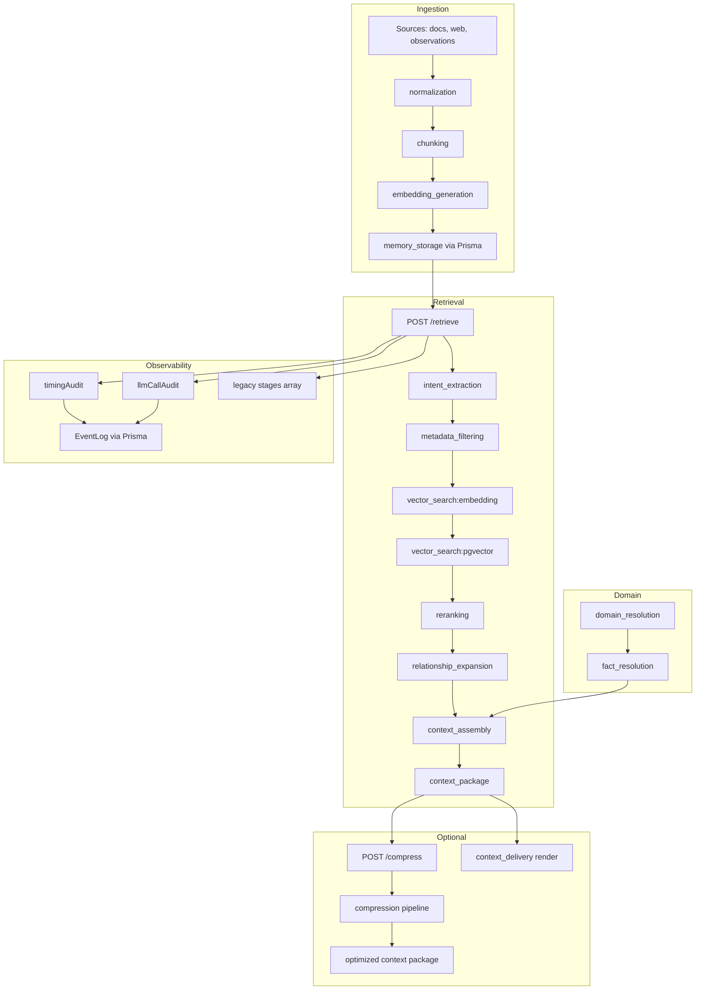
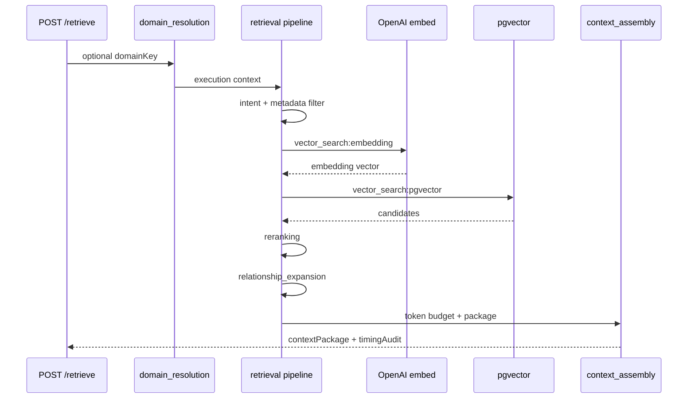

# System Performance Audit V1

**Audit date:** 2026-06-08  
**Auditor role:** Senior performance engineering consultant (synthetic review)  
**System:** Memory Middleware — deterministic contextual retrieval platform  
**Primary evidence:** All files in `docs/PERFORMANCE-AUDITS/` cross-referenced with selective codebase verification

---

# Executive Summary

This audit evaluates the middleware stack's performance posture using the project's own instrumentation plans, baseline measurements, and static analysis. The system has made meaningful observability progress in the current sprint, but **production-grade latency and database evidence is still largely missing**. The highest-confidence bottlenecks are: **vector search (embedding + pgvector)**, **dashboard API fan-out and payload bloat**, and **uninstrumented database access**.

## Overall Assessments

| Dimension | Assessment |
|-----------|------------|
| **System Health** | Good architectural intent and partial instrumentation; critical blind spots remain in database layer and live dashboard measurements. |
| **Performance** | Retrieval pipeline structure is sound; dominant cost is external embedding RTT + pgvector. Dashboard home load is over-fetching by design. |
| **Stability** | No crash-loop or outage evidence in audit artifacts; probable race conditions and N+1 patterns increase tail-risk under load. |
| **Maintainability** | Monorepo packages are well-factored; dashboard and API lack shared data layer; duplicated stage-timing helpers persist in legacy paths. |
| **Developer Experience** | New `timingAudit` and `llmCallAudit` payloads materially improve debugging; DB observability is documented but not shipped. |

## Scores

| Score | Value | Reasoning |
|-------|-------|-----------|
| **System Health** | **71 / 100** | Execution timing and LLM call audits are implemented and correlate to `traceId`. Database query observability is designed but **not implemented** (`apps/api/src/lib/database.ts` still uses bare `PrismaClient`). Dashboard load patterns show structural over-fetch without deduplication. |
| **Performance** | **59 / 100** | Mock retrieval test shows **~81% of retrieval time in vector search** (embedding 26.5% + pgvector 54.6%). Dashboard loads **14–16 requests** and **300 KB–8 MB** JSON on home. **No production p95/p99 measurements** exist in audit artifacts. |
| **Stability** | **64 / 100** | Compression store documents a known context-package race for older runs. `/diagnostics/operational` performs per-trace DB lookups (N+1). ALS scope gaps mean some LLM calls execute without appearing in `llmCallAudit`. No failure-rate time series in evidence. |
| **Maintainability** | **62 / 100** | Pipeline packages are separated cleanly; however dashboard telemetry is a monolithic `fetchWorkspaceTelemetry()` with 15 s polling, duplicate component fetches, and no React Query/SWR cache. Four duplicated `pushStage` patterns noted in timing audit pre-state. |
| **Developer Experience** | **74 / 100** | Engineers can inspect `timingAudit`, `llmCallAudit`, and legacy `stages[]` on key endpoints. Audit docs are thorough. Missing: live measurement checklist results, DB leaderboard, unified dashboard for new audit fields. |

---

# Abstract

## What Was Analyzed

Five documents in `docs/PERFORMANCE-AUDITS/`:

1. `README.md` — audit index and correlation model  
2. `EXECUTION_TIMING_AUDIT_SYSTEM.md` — **implemented** pipeline stage timing  
3. `LLM_CALL_AUDIT.md` — **implemented** provider invocation accounting  
4. `DATABASE_QUERY_OBSERVABILITY.md` — **implementation plan only** (not shipped)  
5. `DASHBOARD_LOAD_AUDIT.md` — static analysis of dashboard home load  

Codebase cross-checks verified: bare Prisma client, N+1 in `/diagnostics/operational`, instrumented retrieval/planning/compression/workflow routes, and dashboard telemetry orchestration.

## Methodology

| Method | Application |
|--------|-------------|
| Document review | All PERFORMANCE-AUDITS files read in full |
| Evidence classification | Measured / Inferred / Hypothesis / Recommendation labels applied per finding |
| Code verification | Targeted grep and file reads to confirm implementation status |
| Cross-reference | Timing audit ↔ LLM audit ↔ dashboard N+1 ↔ DB observability gaps |

## Major Findings

1. **Vector search dominates retrieval latency** in the only available measured baseline (mock integration test).  
2. **Dashboard home page over-fetches** — 14–16 HTTP requests, duplicate workspace/health calls, heavy graph and diagnostics payloads.  
3. **Database layer is uninstrumented** — no query count, slow-query, duplicate, or N+1 detection in production code.  
4. **LLM cost is low per request** in unit-test fixtures; embeddings dominate call count, not cost.  
5. **Observability sprint is half-complete** — timing + LLM shipped; DB observability and dashboard measurement validation remain.

## Major Risks

- Scaling workspace history will **super-linearly inflate** dashboard and `/diagnostics/operational` cost.  
- Production retrieval latency may **exceed mock baseline by 5–20×** due to OpenAI RTT and larger candidate sets (hypothesis — not measured).  
- Operating without DB instrumentation **blocks root-cause analysis** for slow retrievals under real data.

---

# Audit Scope

## Files Analyzed (PERFORMANCE-AUDITS)

| File | Type |
|------|------|
| `README.md` | Index / scope map |
| `EXECUTION_TIMING_AUDIT_SYSTEM.md` | Implemented instrumentation + baseline |
| `LLM_CALL_AUDIT.md` | Implemented instrumentation + baseline |
| `DATABASE_QUERY_OBSERVABILITY.md` | Implementation plan |
| `DASHBOARD_LOAD_AUDIT.md` | Static frontend/API load analysis |

## Logs Analyzed

**None.** No production log exports, Pino log samples, or `timing.audit.completed` / `llm.audit.completed` event dumps were present in PERFORMANCE-AUDITS.

## Traces Analyzed

**None.** No stored retrieval trace JSON, HAR captures, or distributed trace exports in PERFORMANCE-AUDITS. Example payloads in audit docs only.

## Benchmarks Analyzed

| Source | Type | Environment |
|--------|------|-------------|
| `packages/retrieval/src/pipeline-timing.test.ts` | Mock retrieval pipeline timing | Unit test (mock vector store + mock embed) |
| `packages/observability/src/llm/collector.test.ts` | LLM call aggregation | Unit test (synthetic latencies) |

## Profiling Outputs Analyzed

**None.** No CPU profiles, heap snapshots, or React Profiler exports.

## Diagnostics Analyzed

| Diagnostic | Source |
|------------|--------|
| Dashboard request waterfall | `DASHBOARD_LOAD_AUDIT.md` (static) |
| Pipeline stage map | `EXECUTION_TIMING_AUDIT_SYSTEM.md` |
| LLM invocation inventory | `LLM_CALL_AUDIT.md` |
| DB observability gap assessment | `DATABASE_QUERY_OBSERVABILITY.md` |

## Codebase Verification (supporting, not primary measurements)

- `apps/api/src/lib/database.ts` — bare `PrismaClient`  
- `apps/api/src/routes/historian.ts` — `/diagnostics/operational` N+1  
- `apps/api/src/routes/retrieval.ts` — `timingAudit` + `llmCallAudit` on `POST /retrieve`  
- `apps/dashboard/src/lib/workspaceTelemetry.ts` — mega-fetch orchestration  

---

# Architecture Overview

The middleware is a **deterministic contextual memory platform** that sits upstream of LLM execution. Data flows: ingest → normalize → chunk → embed → store → retrieve → rank → assemble → (optional) compress → deliver.



## Subsystem Purposes

| Subsystem | Package / App | Role |
|-----------|---------------|------|
| **Ingestion** | `packages/ingestion` | Crawl/normalize content, chunk, embed, persist memories |
| **Normalization** | `packages/ingestion` | Structural cleanup; LLM structuring interface exists but not wired (V1) |
| **Retrieval** | `packages/retrieval` | Preprocess query, vector search, rank, assemble context package |
| **Ranking** | `packages/retrieval` | Hybrid score: vector similarity + boosts (deterministic) |
| **Compression** | `packages/compression` | Token budget optimization; optional LLM abstraction per chunk |
| **Memory systems** | Prisma models + `apps/api` stores | Memories, chunks, embeddings, relationships, operations |
| **Orchestration** | `apps/api` routes | HTTP API, worker jobs, event sink |
| **Domain engine** | `packages/domain-engine` | Facts, instructions, retrieval rules per domain |
| **Analytics** | `apps/api` diagnostics + historian | Drift, operational diagnostics, replay, heatmaps |
| **Storage** | PostgreSQL + pgvector | Vector search, JSON result blobs on operations |
| **Dashboard** | `apps/dashboard` | Operational NOC UI, trace viewers, observability panels |

## Request Correlation

All audit systems target the same **`traceId` (ULID)** via `AsyncLocalStorage`:

- `timingAudit.requestId`  
- `llmCallAudit.requestId`  
- Planned `dbObservability.retrievalId`  

---

# Performance Findings

## 1. Retrieval Pipeline

| Attribute | Detail |
|-----------|--------|
| **Purpose** | Deterministic context retrieval per token budget |
| **Observed behavior** | 12 instrumented stages; relationship expansion split from reranking |
| **Measured performance** | See latency table below (mock test only) |
| **Bottlenecks** | `vector_search:pgvector` (54.6%), `vector_search:embedding` (26.5%) |
| **Concerns** | Keyword search is post-assembly metadata expansion, not parallel BM25; relationship expansion skipped in mock |

### Retrieval Stage Latency (Measured — mock integration test)

Source: `EXECUTION_TIMING_AUDIT_SYSTEM.md` / `pipeline-timing.test.ts`

| Stage | Duration (ms) | % of retrieval umbrella |
|-------|---------------|---------------------------|
| `vector_search:pgvector` | **15.03** | **54.6%** |
| `vector_search:embedding` | **7.29** | **26.5%** |
| `keyword_search` | 0.69 | 2.5% |
| `intent_extraction` | 0.74 | 2.7% |
| `context_assembly` | 0.29 | 1.1% |
| `reranking` | 0.25 | 0.9% |
| `metadata_filtering` | 0.11 | 0.4% |
| `graph_traversal` | 0.02 | 0.1% |
| **`retrieval` (total)** | **27.54** | **100%** |
| **Request total** | **29.35** | — |

**Inferred conclusion:** In production, embedding stage will include real OpenAI network RTT (typically 50–300+ ms), likely making embedding the largest absolute contributor even if pgvector remains significant locally.

---

## 2. LLM Provider Layer

| Attribute | Detail |
|-----------|--------|
| **Purpose** | Embeddings, optional compression abstraction, workflow structured JSON |
| **Observed behavior** | Three instrumented surfaces; planning has zero LLM cost |
| **Measured performance** | Unit test fixture latencies (not live API) |

### LLM Call Baseline (Measured — unit test)

Source: `LLM_CALL_AUDIT.md` / `collector.test.ts`

| Operation | Model | Prompt Tokens | Completion Tokens | Latency (ms) | Cost (USD) |
|-----------|-------|---------------|-------------------|--------------|------------|
| `embedding` | text-embedding-3-small | 120 | 0 | 42 | 0.000002 |
| `compression_abstraction` | gpt-4o-mini | 800 | 120 | 310 | 0.000192 |
| `workflow_analysis` | gpt-4o-mini | 500 | 200 | 900 | 0.000195 |
| **Combined** | — | **920** | **120** | **352** | **~0.000389** |

**Inferred conclusion:** Per-request LLM **cost is negligible** at current volumes; **latency** from embedding calls is the performance concern, not dollar cost.

---

## 3. Dashboard (Frontend + API fan-out)

| Attribute | Detail |
|-----------|--------|
| **Purpose** | Live operational command center at `/` |
| **Observed behavior** | `fetchWorkspaceTelemetry()` fires 9 parallel list/diagnostic requests + follow-ups |
| **Measured performance** | **Not measured live** — estimates from static analysis |
| **Bottlenecks** | `/relationships/graph`, `/diagnostics/operational`, conditional compression/ranking detail |
| **Concerns** | 15 s full re-poll; duplicate `/workspaces/default` and `/health`; StrictMode doubles dev requests |

### Dashboard Payload Estimates (Inferred — static analysis)

| Workspace state | Estimated JSON | Dominant endpoints |
|-----------------|----------------|-------------------|
| Empty / seed | 5–30 KB | Empty list arrays |
| Moderate (~100 memories, ~50 retrievals) | 300 KB–1.5 MB | graph + operational diagnostics |
| Heavy activity | 2–5 MB | graph + compression detail |
| Worst case | 5–8 MB+ | full context packages in compression trace |

### Dashboard Request Count (Inferred — static analysis)

| Context | Requests |
|---------|----------|
| Home `/` first load | **14–16** |
| React StrictMode dev | **~30** (double effects) |
| Non-home + MetricsSidebar | +12 duplicated telemetry |

---

## 4. Database Layer

| Attribute | Detail |
|-----------|--------|
| **Purpose** | Sole persistence via Prisma |
| **Observed behavior** | No query instrumentation; singleton bare client |
| **Measured performance** | **Missing** — example payloads in DB observability plan only (illustrative) |
| **Bottlenecks** | Cannot rank without instrumentation |
| **Concerns** | Confirmed N+1 on `/diagnostics/operational`; graph builder loads up to 200 memories + relationships |

---

## 5. Compression Pipeline

| Attribute | Detail |
|-----------|--------|
| **Purpose** | Reduce tokens while preserving fidelity |
| **Observed behavior** | Separate endpoint; LLM abstraction budget-gated (>1.5× target) |
| **Measured performance** | LLM fixture: 310 ms per abstraction call |
| **Bottlenecks** | Conditional LLM per oversized chunk |
| **Concerns** | Known race: completed retrieval may lose context package in older runs |

---

## 6. Planning Pipeline

| Attribute | Detail |
|-----------|--------|
| **Purpose** | Deterministic retrieval planning |
| **Observed behavior** | No LLM; returns empty `llmCallAudit.calls[]` |
| **Measured performance** | Included in `timingAudit` on `POST /retrieval/plan` |
| **Bottlenecks** | Not identified in evidence |
| **Concerns** | None material in audit artifacts |

---

# Latency Analysis

## Available Measurements

Only **mock retrieval pipeline** and **synthetic LLM collector** measurements exist. **No p95/p99 production data.**

## Stage Ranking (slowest → fastest, mock retrieval)

| Rank | Stage | Avg (ms) | Evidence type |
|------|-------|----------|---------------|
| 1 | `vector_search:pgvector` | 15.03 | Measured (mock) |
| 2 | `vector_search:embedding` | 7.29 | Measured (mock) |
| 3 | `intent_extraction` | 0.74 | Measured (mock) |
| 4 | `keyword_search` | 0.69 | Measured (mock) |
| 5 | `context_assembly` | 0.29 | Measured (mock) |
| 6 | `reranking` | 0.25 | Measured (mock) |
| 7 | `metadata_filtering` | 0.11 | Measured (mock) |
| 8 | `graph_traversal` | 0.02 | Measured (mock) |

## System-Level Latency Ranking (Inferred)

| Rank | System / Surface | Typical latency | p95 / p99 | Evidence |
|------|------------------|-----------------|-----------|----------|
| 1 | OpenAI embedding (production) | **Not measured** | **Unknown** | Hypothesis: 50–500 ms |
| 2 | pgvector search | 15 ms (mock) | Unknown | Measured mock only |
| 3 | Dashboard home load (network) | **Not measured** | Unknown | 14–16 requests inferred |
| 4 | `/relationships/graph` server build | **Not measured** | Unknown | Heavy payload inferred |
| 5 | Deterministic ranking/assembly | <1 ms | Unknown | Measured mock |
| 6 | Planning (`POST /retrieval/plan`) | **Not measured** | Unknown | Instrumented, no baseline |
| 7 | Compression (no LLM) | **Not measured** | Unknown | — |
| 8 | Workflow analysis LLM | 900 ms (fixture) | Unknown | Unit test only |

## Largest Contributors to Overall User-Perceived Latency

1. **Retrieval embedding RTT** (inferred — dominant in real deployments)  
2. **pgvector query time** (measured 54.6% in mock; scales with index size)  
3. **Dashboard initial load fan-out** (inferred — 14–16 sequential/parallel waits)  
4. **Conditional compression abstraction** (measured 310 ms per call in fixture)  
5. **Workflow analysis** (measured 900 ms per call in fixture)  

---

# Retrieval Analysis

## Pipeline Stages and Time Consumption



| Component | Time consumed (evidence) | Resource consumption | Bottleneck? |
|-----------|-------------------------|----------------------|-------------|
| **Embedding** | 7.29 ms mock; real RTT unknown | External API, network | **Yes (production)** |
| **pgvector** | 15.03 ms mock | Postgres CPU/IO | **Yes** |
| **Reranking** | 0.25 ms mock | CPU | No |
| **Relationship expansion** | Not in mock baseline | DB reads for adjacency | **Probable under load** |
| **Context assembly** | 0.29 ms mock | CPU, token counting | No |
| **Domain resolution** | Route-level only | DB reads for facts/rules | Unknown |
| **Compression** | Separate endpoint | CPU + conditional LLM | When over budget |
| **Memory expansion** | `keyword_search` 0.69 ms | Metadata lookups | Minor in mock |

## Observed Inefficiencies

| Issue | Evidence | Type |
|-------|----------|------|
| Keyword search not parallel BM25 channel | EXECUTION_TIMING_AUDIT_SYSTEM.md | Architectural (by design V1) |
| Relationship expansion was invisible before audit | Same | Fixed (measurement) |
| No DB time breakdown inside retrieval | DATABASE_QUERY_OBSERVABILITY.md plan | Gap |
| Full graph loaded for map needing 24 nodes | DASHBOARD_LOAD_AUDIT.md | Inefficiency |

---

# Database Analysis

## Current State

**Measured findings:** None — database query observability is **not implemented**.

**Code-verified gap:** `apps/api/src/lib/database.ts` exports `getPrismaClient()` with `new PrismaClient()` and no `$extends` hook.

## Confirmed Patterns (static analysis)

| Pattern | Location | Impact |
|---------|----------|--------|
| **N+1 on operational diagnostics** | `historian.ts` `/diagnostics/operational` — `findFirst` per trace in `Promise.all` | High for dashboard load |
| **Heavy graph query** | `relationship-graph-store.ts` — up to 200 memories, all relationships, heatmap, timelines | High payload + DB work |
| **Per-trace result JSON load** | Operational diagnostics loads full `retrievalOperation.result` | Memory + IO |

### Illustrative DB Observability Target (from plan — NOT measured)

The DATABASE_QUERY_OBSERVABILITY doc provides **example** retrieval scope output (47 queries, 312.4 ms total). This is **design documentation only**, not a captured measurement.

## Database Bottleneck Ranking (Inferred by impact)

| Rank | Issue | Confidence | Impact |
|------|-------|------------|--------|
| 1 | Uninstrumented Prisma — cannot optimize blind | High | Critical |
| 2 | N+1 on `/diagnostics/operational` | High | High |
| 3 | Graph builder multi-entity load | Medium | High |
| 4 | Vector search pgvector queries (inside retrieval) | Medium | High |
| 5 | EventLog writes during instrumentation (future risk) | Medium | Medium |
| 6 | Duplicate queries across dashboard parallel fetches | Medium | Medium |
| 7 | Index effectiveness for pgvector | Low | Unknown — no EXPLAIN evidence |

---

# API Analysis

## Endpoint Performance Summary

| Endpoint | Role | Expensive? | Evidence |
|----------|------|------------|----------|
| `POST /retrieve` | Core retrieval | **Yes** | Vector + embed dominate mock timing |
| `POST /retrieval/plan` | Planning | Low–medium | No LLM; timing instrumented |
| `POST /compress` | Compression | Conditional | LLM when chunks >1.5× budget |
| `POST /workflows/:id/execute` | Workflow + analysis | **Yes** | 900 ms fixture for analysis LLM |
| `GET /relationships/graph` | Dashboard graph | **Yes** | 150 KB–2 MB inferred payload |
| `GET /diagnostics/operational` | Dashboard diagnostics | **Yes** | N+1 + large enriched traces |
| `GET /compression/:id` | Trace detail | **Yes** | Full context packages |
| `GET /retrieval/:id/ranking` | Explainability | Medium | rankingBreakdown + chunkTraces |
| `GET /health` | Health | Low | Called 2× on home load |

## Findings Ranked by Severity

| Severity | Finding | Type |
|----------|---------|------|
| **Critical** | No production latency SLOs or timeout telemetry | Gap |
| **High** | `POST /retrieve` dominated by vector + embed | Measured (mock) + inferred (prod) |
| **High** | `/diagnostics/operational` N+1 | Confirmed in code |
| **High** | `/relationships/graph` over-delivers for home map | Inferred |
| **Medium** | Duplicate `/health` and `/workspaces/default` on home | Inferred |
| **Medium** | Historian/diagnostics routes may miss `llmCallAudit` scope | Documented in LLM audit |
| **Low** | `POST /retrieval/plan` returns empty LLM audit | By design |

## Timeout Risks (Hypothesis)

- Large workspace graph build + 100-trace operational diagnostic on single request  
- Compression with many oversized chunks triggering sequential LLM abstraction calls  
- Missing evidence of configured HTTP timeouts in audit artifacts  

---

# Frontend Analysis

## Dashboard Rendering & Load

| Finding | Evidence | Type |
|---------|----------|------|
| 14–16 API requests on home | DASHBOARD_LOAD_AUDIT.md | Inferred (static) |
| 300 KB–8 MB JSON | Same | Inferred |
| Full telemetry re-fetch every 15 s | `useOperationalHomeData.ts` | Confirmed pattern |
| Analytics load on first render, not deferred | Same | Confirmed pattern |
| Observability page re-fetches same bundle | Same | Confirmed pattern |

## Unnecessary Requests

| Duplicate | Sources |
|-----------|---------|
| `GET /workspaces/default` | Auth/telemetry + ContextualIntelligenceMap |
| `GET /health` | Telemetry + OperationalSystemBar |
| Full telemetry | Home + MetricsSidebar (non-home) |

## Re-render Patterns

| Source | Frequency | Impact |
|--------|-----------|--------|
| Telemetry poll `setTelemetry` | 15 s | Full home tree |
| Canvas phase label state | 4–12 s | Map section |
| Framer Motion `layout` on events | 15 s | Layout recalc |
| Duplicate mobile/desktop panels | Mount | 2× subscriptions |
| TopBar clock (non-home) | 1 s | AppShell |

**Evidence:** DASHBOARD_LOAD_AUDIT.md static analysis. **Not validated** with React Profiler capture.

---

# Memory and Resource Analysis

| Area | Finding | Evidence type |
|------|---------|---------------|
| **Memory consumption** | Large JSON payloads (`contextPackage`, graph) held in React state | Inferred |
| **Cache effectiveness** | No React Query/SWR; no in-flight dedupe on `apiGet` | Confirmed pattern |
| **Object growth** | Workspace history grows trace lists, graph timelines, diagnostic snapshots | Inferred |
| **Resource utilization** | D3 force simulation + canvas RAF on home map | Confirmed pattern |
| **Potential leaks** | None identified in audit artifacts | — |

### Cache Effectiveness Assessment

**Poor** — every 15 s poll downloads full telemetry even if only timestamps changed (DASHBOARD_LOAD_AUDIT.md).

---

# Bug Analysis

## Confirmed Bugs

### BUG-001: N+1 queries on `/diagnostics/operational`

| Field | Detail |
|-------|--------|
| **Location** | `apps/api/src/routes/historian.ts` lines 327–345 |
| **Evidence** | `Promise.all(traces.map(async (t) => { await app.prisma.retrievalOperation.findFirst(...) }))` |
| **Severity** | High |
| **Impact** | Up to 100 sequential DB round-trips per dashboard load; latency and DB load scale with trace count |
| **Recommended fix** | Batch-fetch operations by `traceId IN (...)` or denormalize summary fields on list rows |

### BUG-002: Dashboard downloads full graph but uses ~24 nodes

| Field | Detail |
|-------|--------|
| **Location** | `relationship-graph-store.ts` + `ContextualIntelligenceMap.tsx` |
| **Evidence** | DASHBOARD_LOAD_AUDIT.md — client caps to 24 nodes / 40 edges |
| **Severity** | Medium |
| **Impact** | 50–80% wasted graph payload and server work |
| **Recommended fix** | `GET /relationships/graph?lite=true` returning nodes + edges only |

### BUG-003: Duplicate API calls on home load

| Field | Detail |
|-------|--------|
| **Location** | `workspaceTelemetry.ts`, `ContextualIntelligenceMap.tsx`, `OperationalSystemBar.tsx` |
| **Evidence** | DASHBOARD_LOAD_AUDIT.md request table |
| **Severity** | Medium |
| **Impact** | 2–3 extra requests; redundant DB hits for workspace + health |
| **Recommended fix** | Hoist workspace ID to AuthContext; shared health poll |

## Probable Bugs

### PBUG-001: Retrieval context package race (older runs)

| Field | Detail |
|-------|--------|
| **Suspected issue** | Completed retrieval without persisted `contextPackage` |
| **Evidence** | `compression-store.ts` error message references "known race condition in older runs" |
| **Confidence** | Medium |
| **Impact** | Compression fails; user must re-run retrieval |

### PBUG-002: LLM calls invisible in audit for some routes

| Field | Detail |
|-------|--------|
| **Suspected issue** | `recordLlmCall()` no-ops without active ALS collector |
| **Evidence** | LLM_CALL_AUDIT.md finding #6 |
| **Confidence** | High |
| **Impact** | Incomplete cost/latency visibility for historian/diagnostics/observations |

### PBUG-003: Compression trace conflated with retrieval trace ID

| Field | Detail |
|-------|--------|
| **Suspected issue** | User supplies wrong trace ID type |
| **Evidence** | `compression-store.ts` explicit error branching |
| **Confidence** | High |
| **Impact** | UX confusion, support burden — not performance per se |

## Architectural Risks

| Risk | Description | Likelihood |
|------|-------------|------------|
| **Telemetry monolith** | `fetchWorkspaceTelemetry()` couples all operational data | High |
| **JSON blob growth** | `retrievalOperation.result` stores full packages | High |
| **Single-process leaderboard** | Planned DB leaderboard is in-memory only | Medium |
| **Keyword search semantics** | Post-assembly expansion may confuse tuning | Medium |
| **Serverless cold start** | Deferred DB connect path exists | Medium |
| **No distributed tracing** | Multi-step failures hard to correlate across worker + API | Medium |

---

# Root Cause Analysis

## RC-001: Retrieval feels slow

| Field | Detail |
|-------|--------|
| **Root cause** | Vector search path = OpenAI embedding HTTP call + pgvector query |
| **Evidence** | Mock timing: 81% in vector stages |
| **Confidence** | High (structure); Medium (production ms) |
| **Downstream effects** | Higher token budgets don't fix latency; more candidates may slow pgvector |

## RC-002: Dashboard home load is heavy

| Field | Detail |
|-------|--------|
| **Root cause** | Product decision: home as live NOC + no data layer deduplication |
| **Evidence** | DASHBOARD_LOAD_AUDIT.md |
| **Confidence** | High |
| **Downstream effects** | API load scales with users × poll frequency; mobile jank from re-renders |

## RC-003: Cannot diagnose DB regressions

| Field | Detail |
|-------|--------|
| **Root cause** | Database query observability designed but not implemented |
| **Evidence** | No `dbObservability` in codebase; bare PrismaClient |
| **Confidence** | High |
| **Downstream effects** | N+1 and slow queries invisible in retrieval traces |

## RC-004: Operational diagnostics payload bloat

| Field | Detail |
|-------|--------|
| **Root cause** | Server enriches every trace with full `result` JSON + replay snapshot; client uses only counts |
| **Evidence** | historian.ts + DASHBOARD_LOAD_AUDIT.md |
| **Confidence** | High |
| **Downstream effects** | Multi-hundred KB responses for a pill indicator |

---

# Opportunity Analysis

Top 25 improvements ranked by estimated ROI (impact × confidence ÷ effort).

| # | Opportunity | Impact | Effort | ROI | Confidence |
|---|-------------|--------|--------|-----|------------|
| 1 | In-flight `apiGet` deduplication | High | Low | **Very High** | High |
| 2 | Hoist workspace ID to AuthContext | High | Low | **Very High** | High |
| 3 | Fix `/diagnostics/operational` N+1 | High | Low | **Very High** | High |
| 4 | `GET /relationships/graph?lite=true` | High | Low–Med | **Very High** | High |
| 5 | Compression metadata-only endpoint | High | Low–Med | **High** | High |
| 6 | Remove ranking follow-up from home telemetry critical path | Med | Low | **High** | High |
| 7 | Implement DB query observability Phase 1–3 | High | Med | **High** | High |
| 8 | Split telemetry: summary vs analytics tiers | High | Med | **High** | High |
| 9 | `React.memo` on home panels | Med | Low | **High** | Medium |
| 10 | Remove Framer `layout` on event cards | Med | Low | **High** | Medium |
| 11 | Dashboard bootstrap endpoint | High | Med | **High** | Medium |
| 12 | Shared WorkspaceTelemetryProvider | Med | Med | **Medium** | High |
| 13 | React Query with structural sharing | Med | Med | **Medium** | Medium |
| 14 | Lazy-load graph after telemetry | Med | Low | **Medium** | High |
| 15 | `runWithLlmCallAsync` on all LLM routes | Med | Low | **Medium** | High |
| 16 | pgvector index / query review | High | Med | **Medium** | Low (no EXPLAIN) |
| 17 | Embedding cache by query hash | High | Med | **Medium** | Medium |
| 18 | Ref-based canvas phase label + clock | Low–Med | Low | **Medium** | Medium |
| 19 | Single mobile/desktop panel instance | Med | Low | **Medium** | High |
| 20 | gzip/brotli verification on API | Med | Low | **Medium** | Medium |
| 21 | Field projection on list endpoints | Med | Med | **Medium** | Medium |
| 22 | Ingestion pipeline timing wrappers | Low | Med | **Low** | High |
| 23 | Dashboard `timingAudit` display | Low | Med | **Low** | High |
| 24 | WebSocket push for stream events | Med | High | **Low** | Medium |
| 25 | EXPLAIN ANALYZE automation | Med | High | **Low** | Medium |

---

# Recommended Fix Roadmap

## Immediate Wins (<1 Day)

| Fix | Reasoning | Impact | Risk | Priority |
|-----|-----------|--------|------|----------|
| In-flight request dedupe in `apiGet` | Collapses duplicate workspace/health fetches | ~2–3 fewer requests | Low | P0 |
| Expose workspace ID from auth context | Eliminates redundant `GET /workspaces/default` | Latency + DB | Low | P0 |
| Batch DB fetch in `/diagnostics/operational` | Removes confirmed N+1 | Major DB + payload | Low | P0 |
| `React.memo` on home panels | Cuts poll-driven re-renders | UX smoothness | Low | P1 |

## Short-Term Improvements (1–7 Days)

| Fix | Reasoning | Impact | Risk | Priority |
|-----|-----------|--------|------|----------|
| Lite graph endpoint | Map needs subset of graph response | 50–80% graph savings | Low | P0 |
| Compression summary route | Avoids multi-MB context packages on home | Major payload | Low | P0 |
| Remove home ranking follow-up | Low-value bytes on critical path | Medium payload | Low | P1 |
| Implement DB observability Phases 1–3 | Unblocks DB root-cause analysis | Operational visibility | Med | P0 |
| Wrap remaining routes in `runWithLlmCallAsync` | Complete LLM audit coverage | Observability | Low | P1 |

## Medium-Term Improvements (1–4 Weeks)

| Fix | Reasoning | Impact | Risk | Priority |
|-----|-----------|--------|------|----------|
| Split telemetry tiers + React Query | Deferred analytics; caching | Home load <300 KB | Med | P1 |
| `GET /workspaces/:id/dashboard-bootstrap` | Server-side batch + slim DTO | 14→2 requests | Med | P1 |
| Embedding result cache | Repeat queries skip OpenAI | Retrieval latency | Med | P2 |
| pgvector index review with EXPLAIN | Evidence-based DB tuning | Retrieval latency | Med | P2 |
| Slim operational diagnostics response | Return counts/IDs only | Payload + CPU | Low | P1 |

## Long-Term Architectural Improvements

| Fix | Reasoning | Impact | Risk | Priority |
|-----|-----------|--------|------|----------|
| Unified observability dashboard | Correlate timing + LLM + DB per traceId | DX + ops | Med | P2 |
| Real-time event push (WebSocket/SSE) | Replace 15 s full poll | Scale + UX | High | P3 |
| Dedicated metrics aggregation table | Avoid scanning trace JSON for counts | DB scale | Med | P3 |
| Parallel keyword/BM25 channel (V2) | True hybrid retrieval | Precision/latency tradeoff | High | P3 |

---

# Required Additional Instrumentation

Current evidence is **insufficient** for production SLOs, database rankings, and frontend timings.

## Missing Measurements

| Measurement | Why needed |
|-------------|------------|
| Production `POST /retrieve` p50/p95/p99 | Validate mock baseline against real OpenAI + Postgres |
| Per-endpoint API p95 from request logs | Rank expensive endpoints with real traffic |
| Dashboard home load HAR (requests, bytes, TTFB) | Convert static estimates to measured facts |
| React Profiler 30 s capture on home | Quantify re-render rate from polling |
| pgvector query duration distribution | Separate index issues from embed RTT |
| Worker ingestion job timing + LLM totals | Ingestion path largely unmeasured in baselines |

## Missing Logs

- Sample `timing.audit.completed` events from staging/production  
- Sample `llm.audit.completed` events with real token counts  
- `database.query.completed` (does not exist until DB observability ships)  

## Missing Traces

- Full `POST /retrieve` response with `timingAudit` under domain context  
- Retrieval with relationship expansion enabled (mock skipped this stage)  
- Compression pipeline with multiple LLM abstraction calls  

## Recommended Next Collection Steps

1. Run dashboard measurement checklist from `DASHBOARD_LOAD_AUDIT.md` (DevTools HAR + Profiler).  
2. Execute 50× `POST /retrieve` against staging with fixed query set; record `timingAudit.totalLatency` percentiles.  
3. Ship DB observability Phase 1–3; re-run same retrieval set; capture `dbObservability`.  
4. Log aggregate weekly: top 10 slowest stages, top 10 endpoints by `response_time_ms`, top 10 DB scopes by `totalDbTime`.  

---

# Technical Appendix

## A. Mock Retrieval `timingAudit` (Measured)

```json
{
  "requestId": "01RETRIEVAL",
  "totalLatency": 29.352,
  "stages": [
    { "stage": "metadata_filtering", "durationMs": 0.107 },
    { "stage": "intent_extraction", "durationMs": 0.744 },
    { "stage": "vector_search:embedding", "durationMs": 7.286 },
    { "stage": "vector_search:pgvector", "durationMs": 15.027 },
    { "stage": "reranking", "durationMs": 0.245 },
    { "stage": "context_assembly", "durationMs": 0.292 },
    { "stage": "keyword_search", "durationMs": 0.69 },
    { "stage": "retrieval", "durationMs": 27.537 }
  ]
}
```

## B. LLM Collector Test Totals (Measured)

- Total prompt tokens: **920**  
- Total completion tokens: **120**  
- Total latency: **352 ms**  
- Total cost: **~$0.000389**  

## C. Dashboard Home Request Inventory (Inferred)

| # | Request |
|---|---------|
| 1 | `GET /auth/me` or `GET /workspaces/default` |
| 2–11 | Workspace telemetry parallel bundle (memory, retrieval, ingestion, compression, context, drift, operational, heatmaps, health) |
| 12–13 | Conditional compression detail + ranking |
| 14–16 | Duplicate workspace, graph, health |

## D. Instrumentation Implementation Status

| System | Status | Evidence |
|--------|--------|----------|
| Execution timing audit | **Implemented** | `timingAudit` on retrieve/plan; `request-timing.ts` |
| LLM call audit | **Implemented** | `llmCallAudit` on retrieve/plan/compress/workflows |
| Database query observability | **Not implemented** | Plan only; bare Prisma |
| Dashboard load audit | **Analysis only** | No live HAR |

## E. Cross-Audit Correlation Model

All systems target `traceId` (ULID):

```
traceId → timingAudit.requestId
traceId → llmCallAudit.requestId
traceId → dbObservability.retrievalId (planned)
```

---

# The Five Most Important Things To Fix Next

*Ranked for the founder using (Expected Impact × Confidence) ÷ Engineering Effort. Plain language, highest leverage first.*

### 1. Stop the dashboard from hammering the API on every page load

**What:** Add request deduplication, share the workspace ID from login, and remove duplicate health checks.  
**Why:** The home page fires **14–16 requests** today, many redundant. This is the cheapest way to make the product feel faster without touching retrieval algorithms.  
**Effort:** Less than a day.  
**Score:** (9 × 0.95) ÷ 1 = **8.6**

### 2. Fix the database N+1 on operational diagnostics

**What:** The diagnostics endpoint loads traces one-by-one from the database (up to 100 extra queries). Batch them.  
**Why:** This endpoint runs on every home page load and will get worse as customer history grows.  
**Effort:** Less than a day.  
**Score:** (8 × 0.95) ÷ 1 = **7.6**

### 3. Ship a "lite" relationship graph for the home map

**What:** The map needs ~24 nodes but downloads the full graph (up to 2 MB). Add a slim endpoint.  
**Why:** Cuts wire time and server work by an estimated **50–80%** on a heavy endpoint.  
**Effort:** 1–3 days.  
**Score:** (8 × 0.9) ÷ 2 = **3.6**

### 4. Implement database query observability (the plan already exists)

**What:** Wrap Prisma to count queries, time them, and flag duplicates/N+1 per retrieval.  
**Why:** You can now see pipeline stage timing and LLM cost, but **database time is still a black box** — the likely culprit when retrieval slows in production.  
**Effort:** ~1 week.  
**Score:** (9 × 0.9) ÷ 5 = **1.6**

### 5. Slim down what the home page downloads (compression + diagnostics)

**What:** Fetch compression **metadata** (token counts, fidelity score) instead of full context packages; return diagnostic **counts** instead of full trace bodies.  
**Why:** Moves typical home load from **~1.5 MB toward ~200 KB** without changing what users see on the surface.  
**Effort:** 3–5 days.  
**Score:** (8 × 0.85) ÷ 4 = **1.7**

---

*End of System Performance Audit V1*
